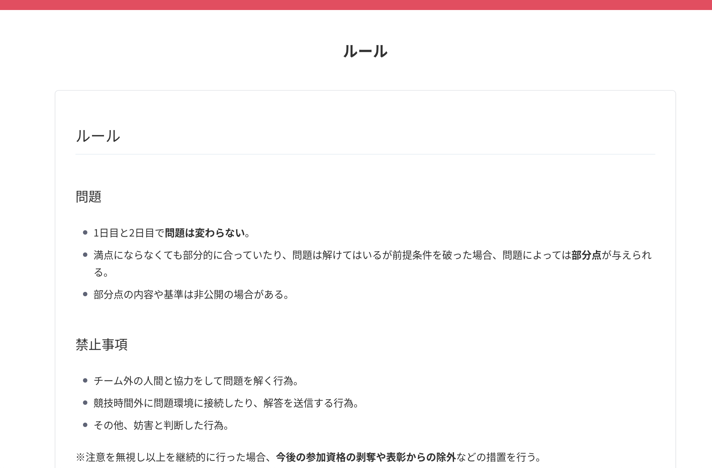
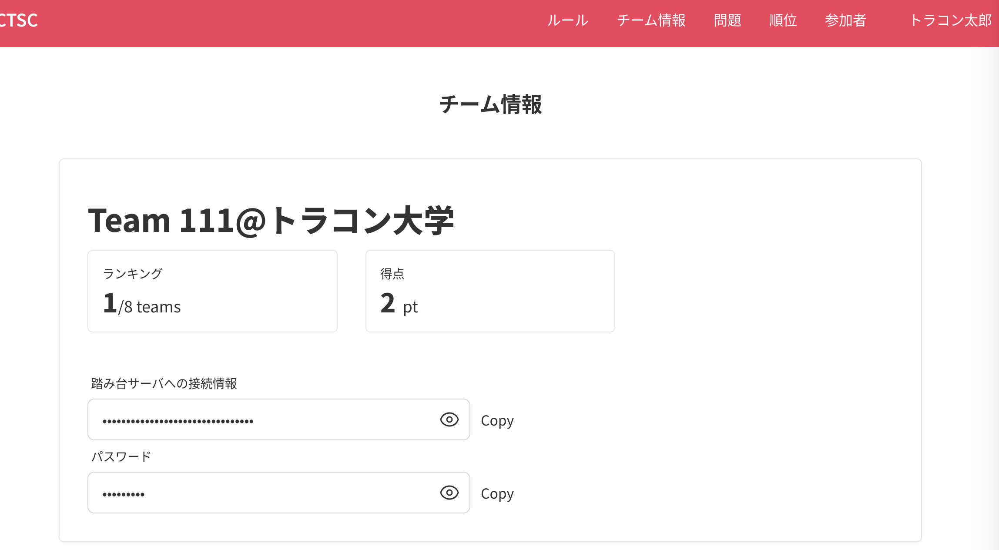
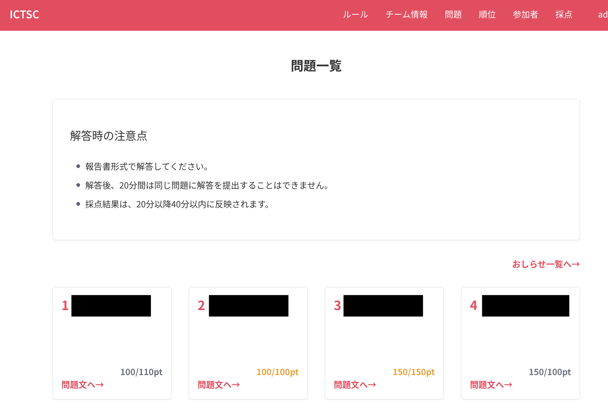
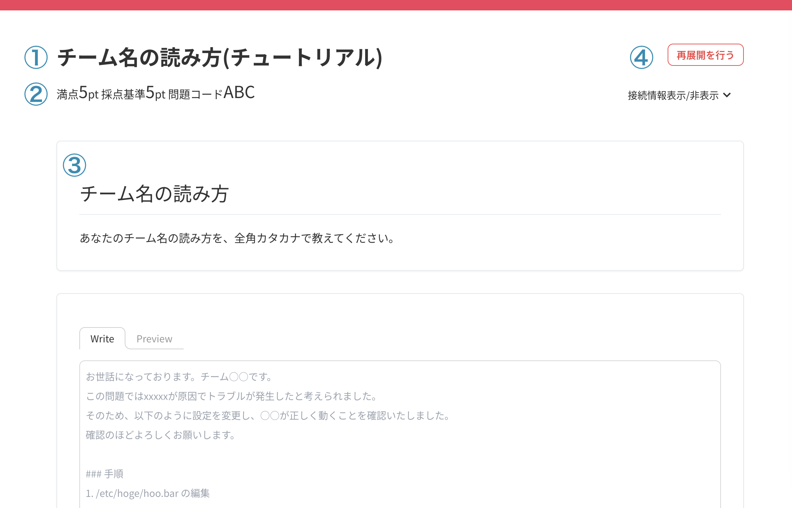
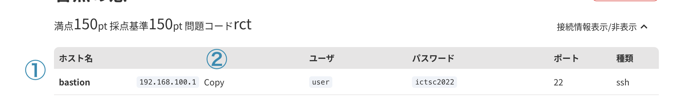
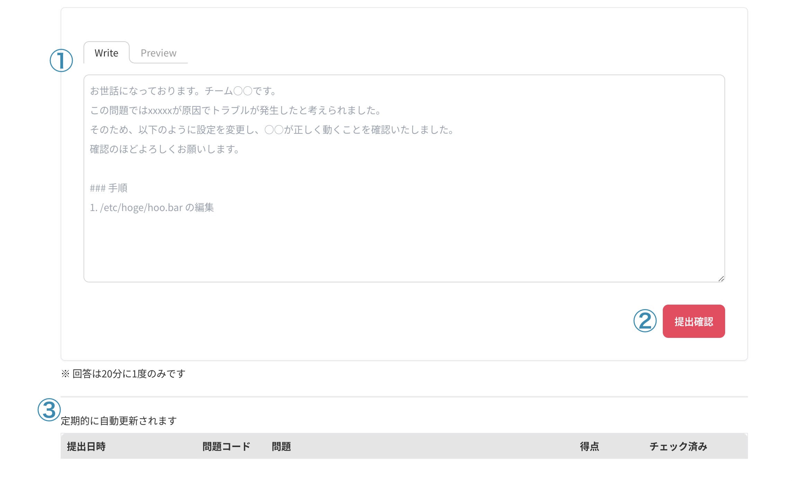
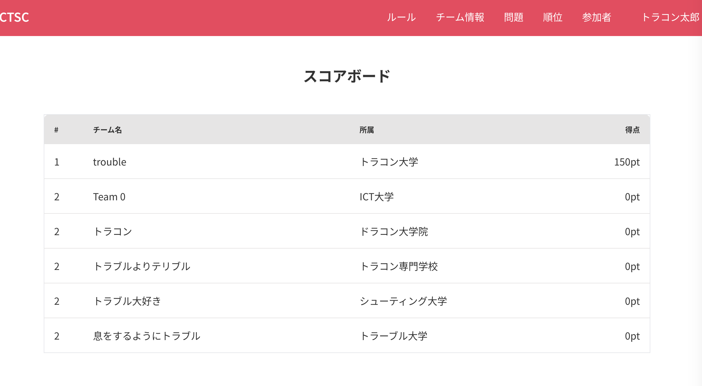

# ICTSC 202 Score Server 使い方紹介

---

<!-- 
_class: text-top
 -->

## トップページ

今回説明したルールなどはトップページに記載されています。

---

<!-- 
_class: text-top
 -->

## チーム情報ページ

踏み台サーバへの接続情報やチームの情報を確認することができます。

---

<!-- 
_class: text-top
 -->

## 問題一覧

各問題をクリックすると問題ページに遷移します。
満点の場合金色になります。

---

<!-- 
_class: text-top
 -->

## 問題ページの見方　1/3

① **問題名**
② **得点、問題コード**
③ **問題文**
④ **再展開を行うボタン**

---

<!-- 
_class: text-top
 -->

## 問題ページの見方　2/3

① **接続情報を閲覧できます**
② **解答のために必要情報はコピーできます**

---

<!-- 
_class: text-top
 -->

## 問題ページの見方　3/3

② **解答フォーム（Markdownで書いてください）**
③ **提出を取得ボタン**
③ **解答一覧を確認（自動更新されます）**

---

<!-- 
_class: text-top
 -->

 ## スコアボード

 全体のランキングが表示されます。
 また、採点後点数は即座に反映されます。

 
