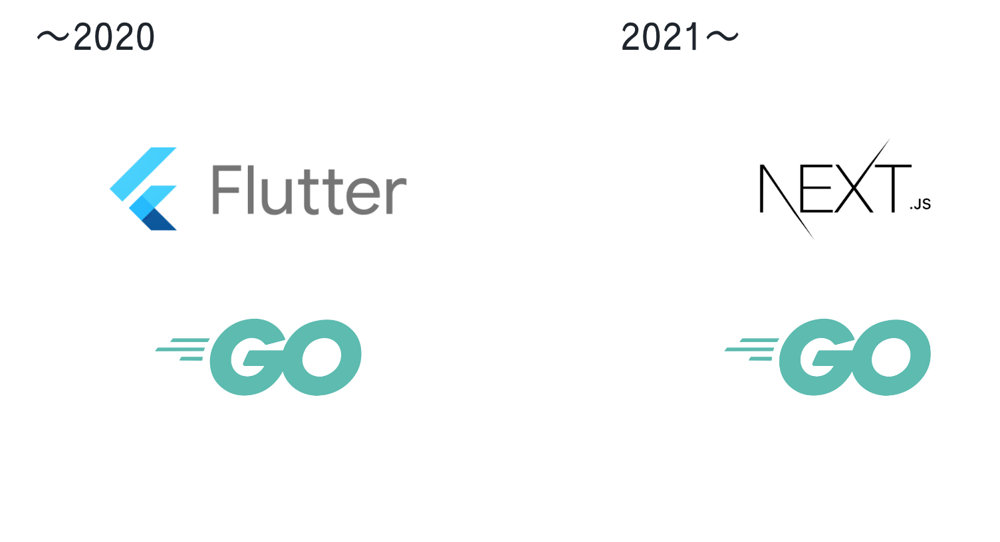
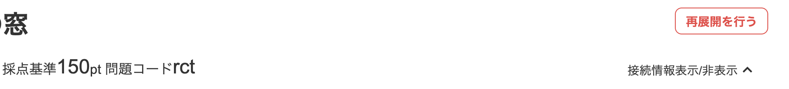
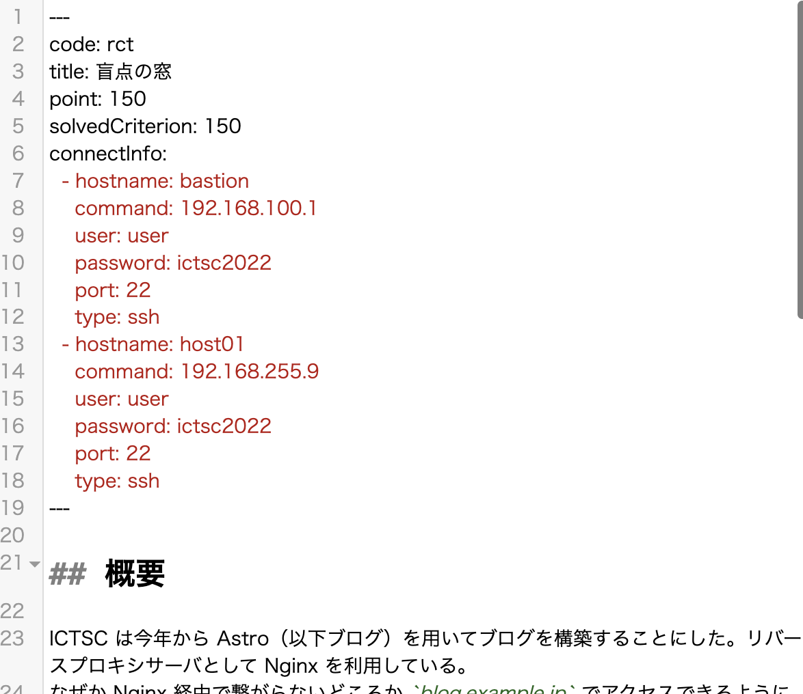
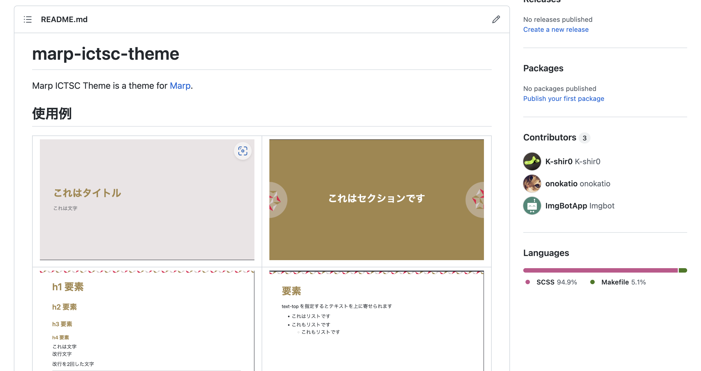

<!--
_class: section-title
_paginate: false
-->

# ICTSC 2022 スコアサーバ紹介　

---

<!-- 
_class: text-top
 -->

## スコアサーバ - 技術スタック

技術スタックは Flutter for Web から Next.js へ

 

---

<!-- 
_class: text-top
 -->

## スコアサーバ

- Flutter for Web を NEXT.js で置き換えました
- Material UI ベースだったのでデザイン面にはあまり苦労はしなかった。
- CSS フレームワークには Tailwind を使用
- CSS コンポーネントには Tailwind ベースの daisy を使用しました

---

<!-- 
_class: text-top
 -->

## ICTSC2022 での変更点

Discord で行っていたものを再展開機能をスコアサーバ側に移した

> 再展開には
> 大いなる力には大いなる責任が伴う

---

<!-- 
_class: text-top
 -->

## 前回のアンケートで言われていた点も修正

- 全体ランキングをが見れるように
- SSH コピペを生成する
- 解答の送信が出来たかわかりにくい

今年度もアンケートにてコメントを募集していますので改善してほしいことがあればお願いします。

---

<!--
_class: section-header text-align-center
_paginate: false
-->

# 問題同期システム

---

<!-- 
_class: text-top
 -->

 ## 問題同期システムの作成 1/4

Growi と言われる Wiki を ICTSC運営は使っている、がスコアサーバ側に問題を手動で移していた。

 

---

<!-- 
_class: text-top
 -->

 ## 問題同期システムの作成 2/4

Growi と言われる Wiki を ICTSC運営は使っている、がスコアサーバ側に問題を手動で移していた。

### 誤りが発生してしまう

 

---

<!-- 
_class: text-top
 -->

 ## 問題同期システムの作成 3/4

Growi から問題と通知を同期することで、問題を移植手間を省いた

 

 ---

<!-- 
_class: text-top
 -->

 ## 問題同期システムの作成 4/4

さらに点数などのメタデータを問題文の Markdown の上に yaml 形式で記述することで反映することが可能に！！

---

<!--
_class: section-header text-align-center
_paginate: false
-->

# ソースコードの公開

---

<!-- 
_class: text-top
 -->

 ## ソースコードの公開 1/2

ICTSC の活動をオープン化する一環として問題サーバのソースコードを公開しました

### ictsc-sachiko-v3(新フロントエンド)
 [https://github.com/ictsc/ictsc-sachiko-v3](https://github.com/ictsc/ictsc-sachiko-v3)

### ictsc-rikka(バックエンド&問題同期)
 [https://github.com/ictsc/ictsc-rikka](https://github.com/ictsc/ictsc-rikka)

### ictsc-sachiko(旧フロントエンド, Flutter)
 [https://github.com/ictsc/ictsc-sachiko](https://github.com/ictsc/ictsc-sachiko)

 ---

 <!-- 
_class: text-top
 -->

 ## ソースコードの公開 1/2

 今回のスライドは marp で書かれておりテーマをこちらで公開中です。

 [https://github.com/ictsc/marp-ictsc-theme](https://github.com/ictsc/marp-ictsc-theme)

